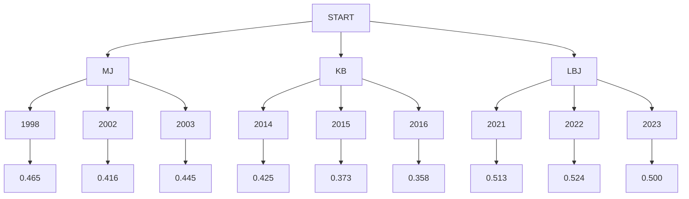

# Task5-HTTPにまわる用語 \:kissing_closed_eyes: 

**<details><summary>URLとは</summary>**

- Uniform Resource Locator
- インターネット上のWEBサイトやファイルの位置や情報を示すもの
- 詳細：
  - プロトコル：セキュリティのため、暗号化されたhttpsを利用する
  - ホスト名：wwwの有無はSEOに対して影響がない
  - ドメイン：ある程度自分で選択可能だが、誤解を招くかも
  
  
    例えば、末尾は`[co.jp]`,`[com.us]`の場合、それぞれ日本向けとUSA向けサービスを提供しているサイトであるという認識されているため、なるべく意図に関係しているアルファベットを選ぶ
  - ディレクトリ：サーバーでファイルを格納するためのフォルダ
    

</details>

**<details><summary>クエリ文字列（Query Parameter）</summary>**

- サーバーに情報を送るためにURLの末尾に付足す変数のこと


  https://*OXOX*.jp　➡　https://*OXOX*.jp/**`?A=B×C`**
- 2種類あり、それぞれ用途が異なる
  -  パッシブパラメータ
    - 表示するコンテンツに影響はない
    - WEBサイトのアクセス解析するため（どこからたどり着いた）
  - アクティブパラメータ
    - 表示されるコンテンツに影響する
    - 例えば、Sサイズをフィルタリングした商品一覧ページ
   
    
      https://*OXOX*.jp/tshirt　➡　https://*OXOX*.jp/tshirt/**`?t=shirt_size=s`**

</details>

**<details><summary>パス変数（Path Parameter）</summary>**

- 動的な値をパスを一部として指定することがパスパラメータ
- 例：http://*www*.example.com/user/12345


  ここで12345の部分がユーザーIDなどを表す変数となっている
- 特徴
  - URLパスに埋め込むので、読み取りが簡単
  - GETリクエストで主で利用される
  - データの取得や測定リソースの操作に利用される
  - 変更がまれないので、キャッシュしやすい

</details>

**<details><summary>クエリ文字列とパス変数の違い</summary>**

- クエリ文字列：特定のリソースを操作し取得する際に必要な情報を入れる
- パス変数：測定のリソースを識別するために必要な情報を入れる

  https://*example*.com/pathparameter/`{pathparameter}`?`queryparameter1=hogehoge&queryparameter2=fugafuga`

  
  1. ドメインの後、？の前にくるのがパスパラメータ
  1. ？の後ろに来るのがクエリパラメータ
  

</details>

---

**<details><summary>HTTPメソッド</summary>**

- GET：

  指定したリソースの表現をリクエストする。GETを使用するリクエストはデータの取り込みに限る
- POST：

  指定したリソースに実体を送信するために使用され、サーバー上の状態を変更したり、副作用が発生する
- PUT:

  対象リソースの現在の表現全体をリクエストのペイロードで置き換える
- PATCH：

  リソースを部分的に変更するために使用する
- DELETE：

  指定したリソースを削除する
  

</details>

**<details><summary>リクエストヘッダー</summary>**

  WEBコンテンツの伝送に用いられるHTTPで、クライアントからサーバへの要求であるHTTPリクエストの前半にある制御情報を記した領域のこと

</details>

**<details><summary>HTTPステータスコード</summary>**

HTTPにおいてWEBサーバからのレスポンスの意味を表示する3桁の数字からなるコードである

</details>

**<details><summary>HTTPステータスコードの意味</summary>**

|Code|意味|説明|
|:--|:--|:--|
|200|OK|リクエストは成功し、レスポンスとともに要求に応じた情報が返される。|
|201|Created|リクエストは完了し、新たに作成されたリソースのURIが返される。|
|400|Bad Request|リクエストが不正である。定義されていないメソッドを使うなど、クライアントのリクエストがおかしい場合に返される。|
|404|Not Found|未検出。リソース・ページが見つからなかった。|
|500|Internal Server Error|サーバ内部エラー。サーバ内部にエラーが発生した場合に返される。|

</details>

---


**<details><summary>ステータスライン</summary>**

- ステータス行は「HTTPのバージョン」と「HTTPステータスコード」から構成されます。ステータス行は常に1行です。


  ```rb
  HTTP/1.1 200
  ```

</details>

**<details><summary>レスポンスヘッダー</summary>**

- HTTPステータスラインに書ききれないレスポンスの情報


  ```rb
  Content-Type: text/html;charset=UTF-8
  Content-Language: ja
  Transfer-Encoding: chunked
  Date: Sun, 04 Apr 2021 02:17:23 GMT
  Keep-Alive: timeout=60
  Connection: keep-alive
  ```

</details>

**<details><summary>レスポンスボディ</summary>**

- ホームページの中身

  
  ```rb
  <!DOCTYPE html>
   <html>
    <head>
          --------------------        省略        ----------------------------
  <body>
   <h1>testTitle</h1>
    <table>
    <thead>
     <tr>
      <th>body</th>
     </tr>
      <tbody>
       <tr>
        <td>test</td>
       </tr>
      </tbody>
     </table>
    </html>
  ```

</details>

---

**<details><summary>JSON</summary>**

- JavaScript Object Notation
- JavaScriptにおけるオブジェクトの書き方を参考に作られたデータフォーマット
- 優れている点は読み書きやすい、処理が重くなりづらい
- 用途
  - データ保存用の形式
  - 異なるプログラミング言語、環境間のデータやり取り
- 参考サイト
>https://datamix.co.jp/media/datascience/introduction-to-json/#:~:text=JSON%E3%81%A8%E3%81%AFJavaScript%20Object,%E3%81%A6%E9%96%8B%E7%99%BA%E3%81%95%E3%82%8C%E3%81%BE%E3%81%97%E3%81%9F%E3%80%82

</details>

**<details><summary>JSONを使って何かのデータを表現する</summary>**

- プレーヤーの名前と年数を選んで当シーズンの成績を検索

```rd
{
”Michael Jordan”:{”1998”:0.465,”2002”:0.416,”2003”:0.445},
”Kobe Bryant”:{”2014”:0.425,”2015”:0.373,”2016”:0.358},
”LeBron James”:{”2021”:0.513,”2022”:0.524,”2023”:0.500}
}
```




</details>


